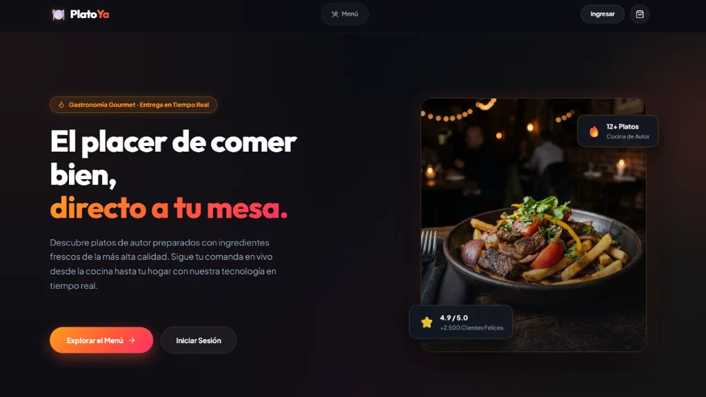

<div align="center">

# 🍽️ PlatoYa

**Plataforma Gourmet Full Stack con Gestión de Cocina y Pedidos en Tiempo Real**

[](https://platos-ya.vercel.app)

👉 **[🌐 Haz clic aquí para entrar a la Aplicación en Vivo](https://platos-ya.vercel.app)** 👈

<br/>

[](https://nextjs.org/)
[](https://nodejs.org/)
[](https://www.mongodb.com/atlas)
[](https://socket.io/)
[](https://platos-ya.vercel.app)

</div>

---

### ⚡ Lo Esencial
* 🎨 **Dark Luxury UI:** Diseño inmersivo, ultra rápido y con imágenes en formato `.webp` (85% de optimización).
* 🔄 **Cocina en Tiempo Real:** Tablero Kanban sincronizado al instante con WebSockets (Socket.IO).
* 🛡️ **Seguridad & Persistencia:** Protección de precios (*Anti Price-Tampering*), Auth.js v5 y base de datos permanente en la nube (MongoDB Atlas).
* ☁️ **Alta Disponibilidad 24/7:** Backend alojado en Render con monitor keep-alive y Frontend en Vercel.

---

### 🔑 Credenciales de Prueba (Demo)

> Úsalas al hacer clic en **[Iniciar Sesión](https://platos-ya.vercel.app/auth/login)** en la web:

| Rol | Correo Electrónico | Contraseña | Experiencia |
| :--- | :--- | :--- | :--- |
| **👤 Cliente** | `cliente@platoya.com` | `cliente123` | Menú interactivo, filtros, carrito y seguimiento de pedidos en vivo |
| **👨‍🍳 Cocinero** | `cocinero@platoya.com` | `cocinero123` | Tablero Kanban para cambiar estados de comandas en tiempo real |

---

### 💻 Ejecución Local Rápida

```bash
# 1. Clonar el repositorio
git clone https://github.com/FrankUsqAbant/PlatosYa.git && cd PlatosYa

# 2. Backend (Autoseed con base de datos en memoria)
cd backend && npm install && npm run dev

# 3. Frontend (En otra terminal)
cd frontend && npm install && npm run dev
```
