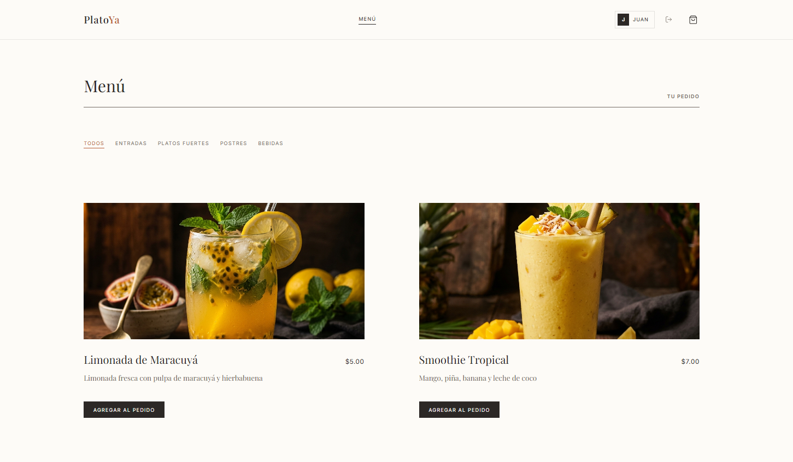

# PlatoYa 🍽️

> *Haz clic en la imagen de arriba para visitar la aplicación en vivo.*

PlatoYa es un sistema moderno e inteligente para la gestión de pedidos de restaurantes, que conecta en tiempo real a los clientes con la cocina, optimizando el flujo de trabajo y ofreciendo una experiencia digital de primera clase.

## 🚀 Tecnologías Principales

- **Frontend:** Next.js, React, CSS Modules (Glassmorphism design)
- **Backend:** Node.js, Express, Socket.io (Sincronización en tiempo real)
- **Base de Datos:** MongoDB Atlas
- **Autenticación:** NextAuth.js
- **Despliegue:** Railway

## 📦 Estructura del Proyecto

El proyecto está dividido en dos monorepositorios:

- `/frontend`: La aplicación web de cara al cliente y al cocinero.
- `/backend`: La API RESTful y el servidor de WebSockets.

## 🔑 Cuentas de Demostración

Si quieres probar los distintos roles en la aplicación en vivo, puedes usar estas credenciales:

- **Cliente (Menú y Pedidos):** `cliente@platoya.com` / `cliente123`
- **Cocinero (Tablero de Cocina):** `cocinero@platoya.com` / `cocinero123`

## 💻 Desarrollo Local

Para ejecutar este proyecto en tu entorno local:

1. Clona este repositorio.
2. Abre una terminal en `/backend` y ejecuta `npm install` y luego `npm run dev` (requiere un archivo `.env` con `MONGODB_URI` y `JWT_SECRET`).
3. Abre otra terminal en `/frontend` y ejecuta `npm install` y luego `npm run dev` (requiere un archivo `.env` configurado).
4. Entra a `http://localhost:3000` en tu navegador.
